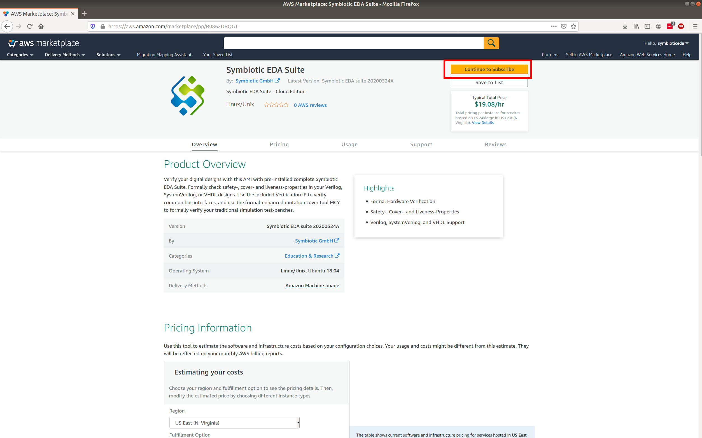
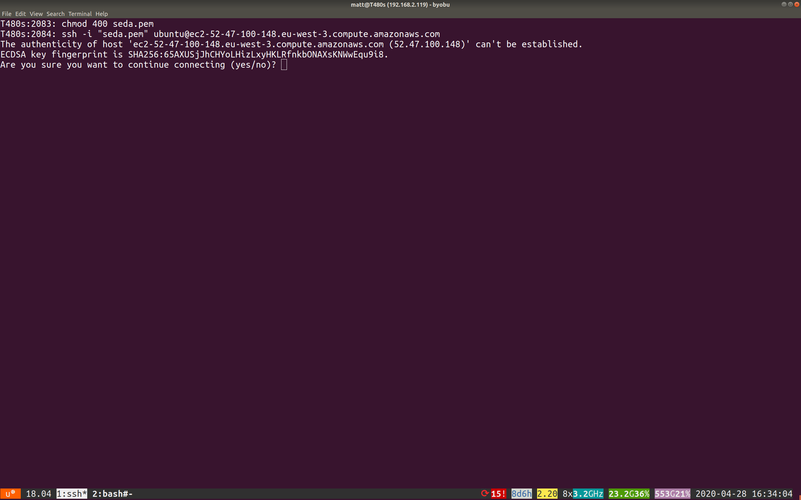

AWS machine instance
--------------------

As well as our monthly license model you can setup an Amazon Web Service machine instance and pay by the hour.

Go to the URL https://aws.amazon.com/marketplace/pp/B0862DRQGT
~~~~~~~~~~~~~~~~~~~~~~~~~~~~~~~~~~~~~~~~~~~~~~~~~~~~~~~~~~~~~~

Click the subscribe button (highlighted with red rectangle).

Continue to configuration
~~~~~~~~~~~~~~~~~~~~~~~~~

.. image:: _static/aws/2.png

Choose your region
~~~~~~~~~~~~~~~~~~

Continue to Launch
~~~~~~~~~~~~~~~~~~

Change instance type
~~~~~~~~~~~~~~~~~~~~
Change the EC2 instance type. If you have a new account, you will be limited to the smallest machine: c5.2xlarge.

Choose default security group
~~~~~~~~~~~~~~~~~~~~~~~~~~~~~
Select default as the security group.

.. image:: _static/aws/6.png

Choose or setup a key pair
~~~~~~~~~~~~~~~~~~~~~~~~~~
If you already have a key pair choose it and skip to page :ref:`Launch the new instance`. 
Otherwise click the link. This will open a new tab where you can create a key pair.

Create the new key pair
~~~~~~~~~~~~~~~~~~~~~~~
Click the button shown.

Name and download the pem key pair
~~~~~~~~~~~~~~~~~~~~~~~~~~~~~~~~~~
Then click the create button.

Save the key pair
~~~~~~~~~~~~~~~~~

.. image:: _static/aws/10.png

Your new keypair will be shown in the list
~~~~~~~~~~~~~~~~~~~~~~~~~~~~~~~~~~~~~~~~~~
Click the previous tab to continue configuration.

Refresh the key pairs
~~~~~~~~~~~~~~~~~~~~~
Click the refresh button to load your new key.

Choose the new key
~~~~~~~~~~~~~~~~~~

Launch the new instance
~~~~~~~~~~~~~~~~~~~~~~~

Go to the EC2 console
~~~~~~~~~~~~~~~~~~~~~
Click the link shown.

Go to the default security group configuration
~~~~~~~~~~~~~~~~~~~~~~~~~~~~~~~~~~~~~~~~~~~~~~
Click the link.

Choose the default group
~~~~~~~~~~~~~~~~~~~~~~~~
Click the link.

Add a new inbound rule
~~~~~~~~~~~~~~~~~~~~~~
Click the button to edit inbound rules.

Add a new rule
~~~~~~~~~~~~~~
Click the button.

Change inbound type to SSH
~~~~~~~~~~~~~~~~~~~~~~~~~~
Click the dropdown and choose SSH.

Setup source IP
~~~~~~~~~~~~~~~
In the source dropdown, choose ‘My IP’.

Save the new rule
~~~~~~~~~~~~~~~~~
Click the button.

View the instances
~~~~~~~~~~~~~~~~~~
Click the instances link.

Connect to the instances
~~~~~~~~~~~~~~~~~~~~~~~~
Click the button.

Copy the chmod text
~~~~~~~~~~~~~~~~~~~
Select and copy the text shown.

Run the command on your downloaded key
~~~~~~~~~~~~~~~~~~~~~~~~~~~~~~~~~~~~~~
In a terminal, go to where you downloaded the key from step Save the key pair. Then paste in the copied text from step Copy the chmod text.

Copy the ssh text
~~~~~~~~~~~~~~~~~
Select and copy the text shown.

Run the ssh command
~~~~~~~~~~~~~~~~~~~
Paste the command copied from step Copy the ssh text.

Confirm connection
~~~~~~~~~~~~~~~~~~
 Type yes and then enter to connect.

Start yosys to test the tools
~~~~~~~~~~~~~~~~~~~~~~~~~~~~~
Type yosys and press enter. You will see the license verified. Type exit to quit.

Terminate instance when finished
~~~~~~~~~~~~~~~~~~~~~~~~~~~~~~~~
Click the actions button, then choose instance state and terminate.

Confirm termination
~~~~~~~~~~~~~~~~~~~
Click the button to confirm termination of the instance.

.. image:: _static/aws/32.png
